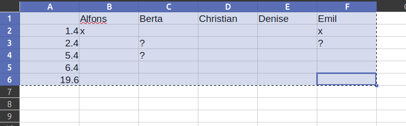
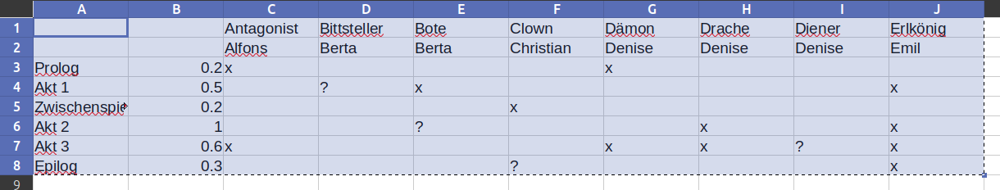
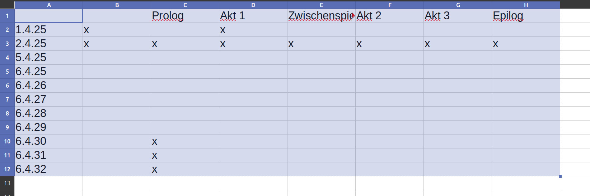

# Probenplan
Ein kleines Tool, um den Probenplanerstellungs- und bearbeitungsprozess nicht ganz so ätzend zu machen. Mit wenigen grundlegenden Kommandos sollte ein Probenplan zu generieren sein.

## Voraussetzungen:
Ein Java Development Kit Version 21 oder höher ist erforderlich, um das Programm auszuführen. Falls das nicht eh schon installiert ist, findest du hier eine Anleitung: <https://www.oracle.com/java/technologies/downloads/#java21>
Auf vielen modernen Rechnern ist Java aber schon installiert.

## Installation und Start:
Zuerst muss das Zip-Archiv `probenplan.zip`, das alle nötigen Dateien enthält, heruntergeladen werden. Du findest es rechts im Browser unter "Releases". Wähle die neueste Version, falls es verschiedene Versionen gibt. Jetzt kannst du die Datei irgendwo entpacken, am Besten in ihren eigenen Ordner.

### Linux und MacOS:
(Ausprobiert auf Linux Mint 22.1 mit Xfce 4.18 und TODO Mac)
Führe einfach `run-on-unix.command` aus. Falls es mit Doppelklick nicht geht, sollte es sich über das Terminal ausführen lassen.
### Windows:
(Ausprobiert auf Windows 11.TODO)
Doppelklicke `run-on-windows.bat`. 

## Verwendung:

### Das Terminal:
Das Programm wird mit Kommandos in einer Terminal (je nach Betriebsystem vielleicht auch Konsole, Eingabeaufforderung oder PowerShell genannt) ausgeführt. Es gibt Autovervollständigung mit der `TAB`-Taste. Die Werte in Klammern sind die Argumente des Befehls. 

Um also zum Beispiel die Rolle des Königs hinzuzufügen, tippst du ein: `add-actor König` und drückst Enter.

### Zur "Länge" der Szenen:
Jeder Szene kann eine Dezimalzahl als "Länge" zugewiesen werden. Standardmäßig versucht das Programm, den Probenplan so zu erstellen, dass die Summe aller in einer Probe geprobten Szenen ungefähr `1` ist.

### Zum Einfügen von csv-Daten:
Die wichtigsten Befehle, um schnell größere Datenmengen zu importieren, verlangen "csv-Daten" als Argument. Gemeint ist damit, dass Daten in einem Tabellenkalkulationsprogramm wie LibreOffice Calc, Excel oder Google Sheets markiert, kopiert und dann in das Terminal eingefügt werden. 
In Linux-Terminals (zumindest auf `xfce4-terminal`, `gnome-terminal` oder `konsole`) kann die Tastenkombination `Ctrl+V` nicht benutzt werden, mit Rechtsklick oder `Ctrl+Shift+V` lassen sich die Daten aber trotzdem einfügen. 
In manchen Terminals, etwa `xfce4-terminal`, wird beim Einfügen der CSV-Daten eine Warnung angezeigt, dass beim Einfügen Kommandos ausgeführt werden. Diese Warnung kommt immer, wenn im einzufügenden Text ein Zeilenumbruch vorkommt und ist kein Grund zur Sorge.

### Die wichtigsten Kommandos:
- `help` --- Zeigt alle Kommandos mit einer kurzen Beschreibung an.
- `exit` --- Beendet das Programm. Hinweis: Das Programm lässt sich auch mit den Standard-"Interrupt"-Tastenkombinationen beenden: Ctrl+C auf Linux, Ctrl+B auf Windows, Cmd+C auf MacOS. (TODO ausprobieren.)
- `csv-times <csv-data>` --- Importiert eine Tabelle aus Schauspielenden und Probenterminen, mit Markierungen, an welchen Tagen sie nicht können: "x" für "gar nicht", "?" für "vielleicht", alles andere für ja.
Beispiel: 
- `csv-scenes <csv-data>` --- Importiert eine Tabelle aus Rollen und Szenen: "x" für "wichtig", "?" für "weniger wichtig", alles andere für "kommt nicht vor". In der Spalte neben den Szenennamen ist die Länge der Szene notiert. In der Zeile unter den Rollennamen sind die Schauspieler notiert.
Beispiel: 
- `csv-lock <csv-data>` --- Importiert eine Tabelle aus Rollen und Szene: "x" heißt, dass diese Szene an diesem Tag auf jeden Fall geprobt werden soll. Das ist zum Beispiel nützlich, um bereits vergangene Proben bei der Generierung zu berücksichtigen. In der Spalte neben den Probenterminen kann festgelegt werden, ob die ganze Probe "gelockt" sein soll – bei einem "x" können auch keine Szenen zu dieser Probe hinzugefügt werden.
Beispiel: 
- `clear-data` --- Löscht alle Daten.
- `show-data` --- Zeigt den aktuellen Stand der Daten, die du eingegeben hast.
- `possible-overview` --- Zeigt eine Liste aller Szenen und Probentermine an, und wie vollständig sie geprobt werden könnten.
- `generate [iterations] [initial_seed]` --- Generiert einen Probenplan basierend auf den Parametern. Je mehr `iterations` gewählt werden, desto länger dauert die Generierung, aber desto höher ist auch die Chance auf einen besseren Plan. Bei leergelassenem Feld ist der Standardwert 50.000. `initial_seed` bestimmt den Zufallsgenerator, bei gleichem seed kommt immer auch das gleiche Ergebnis raus. Wird das Feld leergelassen, wird ein zufälliger seed gewählt.
<!--- `lock-generated` --- Setzt alle Proben und Termine (wie in `lock`) so, wie sie im generierten Probenplan vorkommen.-->
- `save-to-clipboard [locks]` --- Generiert eine csv-Daten aus dem generierten Probenplan, welche dann in ein Tabellenkalkulationsprogramm kopiert werden können. Wenn `locks` `1` ist, wird eine Tabelle generiert, die für `csv-lock` genutzt werden könnte. Wenn `locks` fehlt oder einen anderen Wert hat, wird eine Tabelle generiert, die einen für Menschen gut lesbaren Probenplan enthält.

<!--
### Für kleinere Änderungen während des Probenprozesses:
- `add-actor <name>` --- Schauspielerin mit angegebenem Namen hinzufügen.
- `add-rehearsal <date>` --- Probendatum hinzufügen. Datum sollte im Format tt.MM.yyyy oder tt.MM.yy sein.
- `add-role <name>` --- Rolle mit angegebenem Namen hinzufügen.
- `add-scene <name> <length> <index>` --- Szene hinzufügen. Die Länge soll eine Vergleichbarkeit zwischen Szenen bieten, `index` bestimmt die Reihenfolge (Szenen mit niedrigerem Index kommen zuerst im Stück vor).
- `assign-actor <role-name> <actor-name>` --- Rolle einer Schauspielerin zuweisen.
- `edit-actor <old-name> <new-name>` --- Namen einer Schauspielerin ändern.
- `edit-role <old-role-name> <new-role-name>` --- Namen einer Rolle ändern.
- `edit-scene-name <old-scene-name> <new-scene-name>` --- Namen einer Szene ändern.
- `edit-scene-length <scene-name> <length>` --- Ändert die Länge einer Szene.
- `edit-scene-index <scene-name> <index>` --- Ändert den Index einer Szene.
- `set-has-time <actor-name> <rehearsal-date> <x|y|?>` --- Legt fest, ob eine Schauspielerin an einem bestimmten Termin Zeit hat. `x` bedeutet, sie hat keine Zeit, `y` bedeutet, sie hat Zeit, `?` bedeutet, sie ist unsicher, oder dass es ungünstig wäre.
- `set-takes-part <role-name> <scene-name> <x|n|?>` --- Legt fest, ob eine Rolle in einer Szene vorkommt. `x`, wenn sie eine große oder normale Rolle spielt, `?`, wenn sie nur am Rand vorkommt, `n`, wenn sie gar nicht vorkommt.
- `delete-actor <actor-name>` --- Löscht eine Schauspielerin. Die zugewiesenen Rollen bleiben erhalten.
- `delete-role <role-name>` --- Löscht eine Rolle. Die zugeschriebene Schauspielerin bleibt erhalten.
- `lock <scene-name> <rehearsal-date>` --- Setzt eine bestimmte Szene auf eine bestimmte Probe. Dies wird bei der Probenplangenerierung immer berücksichtigt.
- `unlock <scene-name> <rehearsal-date>` --- Macht den obigen Befehl wieder rückgängig.
- `unlock-all` --- Entfernt alle locks auf Szenen und Proben.
-->

### Finetuning der Generierung
- `show-params` --- Zeigt den aktuellen Wert der Generierungsparameter.
- `set-param <param-name> <value>` --- Legt einen Generierungsparameter auf einen bestimmten Wert fest. Die Standardwerte sollten gut funktionieren, aber du kannst auch mit anderen Werten experimentieren. Beschreibungen der Parameter sind im Quellcode unter ParamsDTO.java zu finden. Wenn du mit anderen Werten bessere Ergebnisse erzielst, teile es mir bitte mit!

