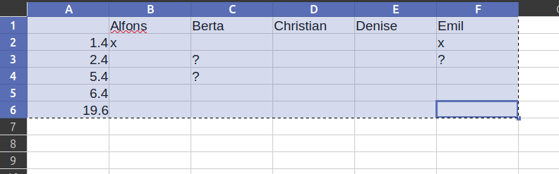

# Probenplan
Ein kleines Tool, um den Probenplanerstellungs- und bearbeitungsprozess nicht ganz so ätzend zu machen. Die Voreinstellungen sollten genügen, wenn alles glatt läuft, müsst ihr nur mit `csvActorsTimes` und `csvRolesScenes` die Daten importieren und dann mit `generate` einen Probenplan erstellen. Die restlichen Kommandos dienen zum Finetuning oder um Änderungen während der Probenzeit zu berücksichtigen.

## Installation:
TODO

## Ausführung:
TODO

## Kommandos:
Das Programm wird durch die Eingabe von Kommandos benutzt. Einige Kommandos können weitere Parameter annehmen. Wenn diese Paramter erforderlich sind, werden sie in dieser Hilfe in (runden Klammern) angezeigt. Sind sie optional, sind sie in [eckigen Klammern] angezeigt. 
Beispiel: Einfach nur `deleteRole` einzutippen, führt zu einem Fehler. `deleteRole König` kann dagegen erfolgreich sein (wenn eine Rolle namens "König" existiert und gelöscht werden darf). Sowohl `editActor` als auch `editActor Sara` dagegen sind erfolgreich, denn der Parameter `actor_name` ist optional. Es geschehen dann unterschiedliche Dinge. 
Innerhalb des Programms gibt es zwei verschiedene Modi, in denen unterschiedliche Kommandos zur Verfügung stehen. Einige Kommandos sind immer verfügbar:

- `help` --- Zeigt diese Hilfe an.
- `create` --- Wechselt in den `createMode`.
- `suggest` --- Wechselt in den `suggestMode`.

### createMode
In diesem Modus kannst du festlegen, welche Szenen, Rollen, Schauspielenden und Probentermine es gibt, welche Schauspielenden an welchen Terminen Zeit haben, von welcher Schauspielerin eine Rolle gespielt wird, welche Rollen in welchen Szenen vorkommen und wie lang die Szenen sind.

- `csvActorsTimes (csvData)` --- Importiert eine Tabelle aus Schauspielenden und Probenterminen, mit Markierungen, an welchen Tagen sie nicht können: "x" für "gar nicht", "?" für "vielleicht", alles andere für ja.
Beispiel: 
Einfach aus LibreOffice Calc/Google-Sheets/Excel kopieren und hinter "csvActorsTimes" einfügen.
- `csvRolesScenes (csvData)` --- Importiert eine Tabelle aus Rollen und Szenen: "x" für "wichtig", "?" für "weniger wichtig", alles andere für "kommt nicht vor".
TODO Screenshot einbinden! Zeile unter den Rollennamen: Schauspielernamen. Spalte neben den Szenen: Größe
Einfach aus LibreOffice Calc/Google-Sheets/Excel kopieren und hinter "csvRolesScenes" einfügen.
- `editActor [actor_name]` --- Namen ändern. Ohne Argument kannst du auch eine neue Schauspielerin hinzufügen.
- `editRole [role_name]` --- Namen und zugeschriebene Schauspielerin ändern. Ohne Argument kannst du eine neue Rolle hinzufügen.
- `editScene [scene_name]` --- Namen, Länge und Index (für die Reihenfolge) ändern. Ohne Argument kannst du eine neue Szene hinzufügen.
- `editHasTime (actor_name) (rehearsal_date)` --- Ändern, ob eine bestimmte Schauspielerin an einem bestimmten Termin Zeit hat.
- `editTakesPart (role_name) (scene_name)` --- Ändern, ob eine bestimmte Rolle in einer Szene vorkommt.
- `deleteActor (actor_name)` --- Löscht eine Schauspielerin.
- `deleteRole (role_name)` --- Löscht eine Rolle.

### suggestMode
In diesem Modus kannst du sehen, welche Szenen an welchen Tagen geprobt werden können, kannst die Parameter festlegen, nach denen ein Probenplan automatisch generiert werden soll, und kannst diesen Probenplan ansehen und speichern.

- `possibleDates` --- Zeigt eine Tabelle aller Szenen an, und an welchen Tagen sie geprobt werden können.
- `possibleScenes` --- Zeigt eine Tabelle aller Probentermine an, und welche Szenen an ihnen geprobt werden können.
- `possibleOverview` --- Zeigt diese Daten in komprimierter Form an.
- `showParams` --- Zeigt den aktuellen Wert der Generierungsparameter.
- `durchlaufprobeAmount` --- Legt die Anzahl an Durchlaufproben fest.
- `durchlaufprobeDate (earliest_date) (latest_date) [index]` --- Legt fest, in welchem Bereich die `index`-te Durchlaufprobe stattfinden soll. Wenn `index` weggelassen wird, setzt es die Werte für die erste Durchlaufprobe.
- `setDate (scene_name) (rehearsal_date)` --- Setzt eine bestimmte Szene auf eine bestimmte Probe. Dies wird bei der Probenplangenerierung immer berücksichtigt.
- `unsetDate [scene_name] [rehearsal_date]` --- Macht den obigen Befehl wieder rückgängig. Löscht alle gesetzten Befehle, wenn genauere Angaben fehlen.
- `setStickyWeight (weight)` --- Legt die Präferenz, dass benachbarte Szenen in der gleichen Probe geprobt werden, auf einen Wert zwischen 0 (unwichtig) und 4 (sehr wichtig).
- `setOrderWeight (weight)` --- Legt die Präferenz, dass die Szenen in der richtigen Reihenfolge geprobt werden (frühe Szenen an frühen Terminen etc.), auf einen Wert zwischen 0 (unwichtig) und 4 (sehr wichtig).
- `setCompletenessweight (weight)` --- Legt die Präferenz, dass möglichst alle Schauspielenden in einer Probe sein können, inklusive derer, die nur einen kleinen Auftritt in der Szene haben, auf einen Wert zwischen 0 (unwichtig) und 4 (sehr wichtig).
- `setNumberOfRehearsals (number)` --- Legt fest, wie oft eine Szene im Schnitt geprobt werden soll. Die Durchlaufprobe ist dabei nicht miteinberechnet.
- `generate` --- Generiert einen Probenplan basierend auf den Parametern.
- `showGenerated` --- Zeigt erneut den generierten Probenplan.
- `setGeneratedDates` --- Setzt alle Proben und Termine (wie in `setDate`) so, wie sie im generierten Probenplan vorkommen.
- `saveToCsv` --- Generiert eine csv-Datei aus dem generierten Probenplan.
