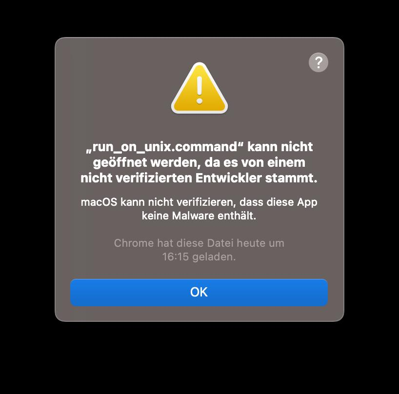

# Probenplan
Ein kleines Tool, um den Probenplanerstellungs- und bearbeitungsprozess nicht ganz so ätzend zu machen. Mit wenigen grundlegenden Kommandos sollte ein Probenplan zu generieren sein.

## Voraussetzungen:
Ein Java Development Kit Version 21 oder höher ist erforderlich, um das Programm auszuführen. Falls das nicht eh schon installiert ist:

### Linux:
Am Besten installierst du java einfach über den Paketmanager deiner Distribution.

### MacOs:
Lade den passenden Installer von <https://www.oracle.com/java/technologies/downloads/#jdk21-mac> herunter. 

Achte auf die richtige Version, und das richtige Betriebssystem! Neuere Versionen sind in Ordnung, aber es sollte mindestens JDK 21 sein. **Wichtig**: Je nachdem, was für ein Chip in deinem Mac eingebaut ist, musst du unterschiedliche Dateien runterladen. Hast du einen Intel-Chip eingebaut, lade `x64 DMG Installer` herunter, hast du einen neuen Apple Chip eingebaut, lade `ARM64 DMG Installer` herunter. Ansonsten gibt es bei der Installation eine Fehlermeldung mit "Falsche Installationsprogrammarchitektur". Die heruntergeladene Datei dann einfach ausführen und durch die Installation klicken.

### Windows:
Lade den passenden Installer von https://www.oracle.com/java/technologies/downloads/#jdk21-windows herunter.

Achte auf die richtige Version, und das richtige Betriebssystem! Neuere Versionen sind in Ordnung, aber es sollte mindestens JDK 21 sein. Lade den Installer herunter, führe ihn aus und klicke dich durch die Installation.

## Installation und Start:
Zuerst muss das Zip-Archiv `probenplan.zip`, das alle nötigen Dateien enthält, heruntergeladen werden. Du findest es rechts im Browser unter "Releases". Wähle die neueste Version, falls es verschiedene Versionen gibt. Jetzt kannst du die Datei irgendwo entpacken, am Besten in ihren eigenen Ordner.

### Linux und MacOS:
(Ausprobiert auf Linux Mint 22.1 mit Xfce 4.18 und TODO Mac)
Führe einfach `run-on-unix.command` aus. Falls es mit Doppelklick nicht geht, sollte es sich über das Terminal ausführen lassen. 

#### MacOS: 
Beim ersten Mal ausführen kriegst du wahrscheinlich eine Warnung wie diese:  (Ich versprech's auch ganz fest, dass das kein Virus ist, aber so ein Account bei Apple kostet 99$ im Jahr, das ist es mir jetzt nicht ganz wert tbh.) Hier ist ein kurzes Tutorial, wie du es trotzdem öffnen kannst: <https://support.apple.com/de-de/guide/mac-help/mh40616/mac> Das passiert nur beim ersten Mal, danach solltest du es einfach so ausführen können.

### Windows:
(Ausprobiert auf Windows 11)
Doppelklicke `run-on-windows.bat`. Beim ersten Mal ausführen kommt wahrscheinlich eine Fehlermeldung wie "Der Computer wurde durch Windows geschützt." Einfach auf "Weitere Informationen", dann auf "Trotzdem ausführen" klicken.

## Verwendung:

### Das Terminal:
Das Programm wird mit Kommandos in einem Terminal (je nach Betriebsystem vielleicht auch Konsole, Eingabeaufforderung oder PowerShell genannt) ausgeführt. Es gibt Autovervollständigung mit der `TAB`-Taste. Die Werte in Klammern sind die Argumente des Befehls. Ein Kommando wird ausgeführt, indem es eingetippt und dann `ENTER` gedrückt wird. Es kann nur ein Kommando auf einmal ausgeführt werden.

### Zur "Länge" der Szenen:
Jeder Szene kann eine Dezimalzahl als "Länge" zugewiesen werden. Standardmäßig versucht das Programm, den Probenplan so zu erstellen, dass die Summe aller in einer Probe geprobten Szenen ungefähr `1` ist.

### Zum Einfügen von table-Daten:
Die wichtigsten Befehle, um schnell größere Datenmengen zu importieren, verlangen "table-Daten" als Argument. Gemeint ist damit, dass Daten in einem Tabellenkalkulationsprogramm wie LibreOffice Calc, Excel oder Google Sheets markiert, kopiert und dann in das Terminal eingefügt werden. 
#### WICHTIG: Windows:
Wegen einigen... Eigenheiten des Windows-Terminals lassen sich die Daten leider nicht einfach einfügen. Stattdessen kannst du die Daten kopieren und als Argument dann einfach `!` eingeben, also zum Beispiel `import-scenes !`, und dann `ENTER` drücken. Die Daten werden dann direkt aus dem Clipboard kopiert. Die Daten müssen *nicht* eingefügt werden.

#### Linux:
In Linux-Terminals (zumindest auf `xfce4-terminal`, `gnome-terminal` oder `konsole`) kann die Tastenkombination `Ctrl+V` nicht benutzt werden, mit Rechtsklick oder `Ctrl+Shift+V` lassen sich die Daten aber trotzdem einfügen. 
In manchen Terminals, etwa `xfce4-terminal`, wird beim Einfügen der CSV-Daten eine Warnung angezeigt, dass beim Einfügen Kommandos ausgeführt werden. Diese Warnung kommt immer, wenn im einzufügenden Text ein Zeilenumbruch vorkommt und ist kein Grund zur Sorge.

### Die wichtigsten Kommandos:
- `help` --- Zeigt alle Kommandos mit einer kurzen Beschreibung an.
- `exit` --- Beendet das Programm. Hinweis: Das Programm lässt sich auch mit den Standard-"Interrupt"-Tastenkombinationen beenden: Ctrl+C auf Linux, Ctrl+B auf Windows, Cmd+C auf MacOS. (TODO ausprobieren.)
- `import-times <table-data>` --- Importiert eine Tabelle aus Schauspielenden und Probenterminen, mit Markierungen, an welchen Tagen sie nicht können: "x" für "gar nicht", "?" für "vielleicht", alles andere für ja.
Beispiel: 
- `import-scenes <table-data>` --- Importiert eine Tabelle aus Rollen und Szenen: "x" für "wichtig", "?" für "weniger wichtig", alles andere für "kommt nicht vor". In der Spalte neben den Szenennamen ist die Länge der Szene notiert. In der Zeile unter den Rollennamen sind die Schauspieler notiert.
Beispiel: 
- `import-locks <table-data>` --- Importiert eine Tabelle aus Rollen und Szene: "x" heißt, dass diese Szene an diesem Tag auf jeden Fall geprobt werden soll. Das ist zum Beispiel nützlich, um bereits vergangene Proben bei der Generierung zu berücksichtigen. In der Spalte neben den Probenterminen kann festgelegt werden, ob die ganze Probe "gelockt" sein soll – bei einem "x" können auch keine Szenen zu dieser Probe hinzugefügt werden.
Beispiel: 
- `clear-data` --- Löscht alle Daten.
- `show-data` --- Zeigt den aktuellen Stand der Daten, die du eingegeben hast.
- `possible-overview` --- Zeigt eine Liste aller Szenen und Probentermine an, und wie vollständig sie geprobt werden könnten.
- `generate [iterations] [initial_seed]` --- Generiert einen Probenplan basierend auf den Parametern. Je mehr `iterations` gewählt werden, desto länger dauert die Generierung, aber desto höher ist auch die Chance auf einen besseren Plan. Bei leergelassenem Feld ist der Standardwert 50.000. `initial_seed` bestimmt den Zufallsgenerator, bei gleichem seed kommt immer auch das gleiche Ergebnis raus. Wird das Feld leergelassen, wird ein zufälliger seed gewählt. **Hinweis:** Das kann wirklich eine Weile dauern, auf meinem Laptop mit Daten vom "Revisor" braucht der für 50.000 Durchläufe etwa 5 Minuten. Also nicht wundern, und einfach was anderes machen in der Zeit. Wenn der Fortschrittsbalken sich allerdings längere Zeit nicht bewegt, ist wahrscheinlich etwas falsch - bitte schreibt mir dann, damit ich mich um das Problem kümmern kann.
<!--- `lock-generated` --- Setzt alle Proben und Termine (wie in `lock`) so, wie sie im generierten Probenplan vorkommen.-->
- `export-to-clipboard [locks]` --- Generiert Tabellendaten aus dem generierten Probenplan, welche dann in ein Tabellenkalkulationsprogramm kopiert werden können. Wenn `locks` `1` ist, wird eine Tabelle generiert, die für `import-locks` genutzt werden könnte. Wenn `locks` fehlt oder einen anderen Wert hat, wird eine Tabelle generiert, die einen für Menschen gut lesbaren Probenplan enthält. Das heißt: Du generierst einen Probenplan mit `generate`, gibst `save-to-clipboard` ein, und drückst `Ctrl+V` (bzw. `Cmd+V` auf MacOS) oder `Rechtsklick→Einfügen` ein einem Tabellenkalkulationsprogramm wie Google Sheets, um diesen generierten Probenplan als Dokument für die Gruppe veröffentlichen zu können.

<!--
### Für kleinere Änderungen während des Probenprozesses:
- `add-actor <name>` --- Schauspielerin mit angegebenem Namen hinzufügen.
- `add-rehearsal <date>` --- Probendatum hinzufügen. Datum sollte im Format tt.MM.yyyy oder tt.MM.yy sein.
- `add-role <name>` --- Rolle mit angegebenem Namen hinzufügen.
- `add-scene <name> <length> <index>` --- Szene hinzufügen. Die Länge soll eine Vergleichbarkeit zwischen Szenen bieten, `index` bestimmt die Reihenfolge (Szenen mit niedrigerem Index kommen zuerst im Stück vor).
- `assign-actor <role-name> <actor-name>` --- Rolle einer Schauspielerin zuweisen.
- `edit-actor <old-name> <new-name>` --- Namen einer Schauspielerin ändern.
- `edit-role <old-role-name> <new-role-name>` --- Namen einer Rolle ändern.
- `edit-scene-name <old-scene-name> <new-scene-name>` --- Namen einer Szene ändern.
- `edit-scene-length <scene-name> <length>` --- Ändert die Länge einer Szene.
- `edit-scene-index <scene-name> <index>` --- Ändert den Index einer Szene.
- `set-has-time <actor-name> <rehearsal-date> <x|y|?>` --- Legt fest, ob eine Schauspielerin an einem bestimmten Termin Zeit hat. `x` bedeutet, sie hat keine Zeit, `y` bedeutet, sie hat Zeit, `?` bedeutet, sie ist unsicher, oder dass es ungünstig wäre.
- `set-takes-part <role-name> <scene-name> <x|n|?>` --- Legt fest, ob eine Rolle in einer Szene vorkommt. `x`, wenn sie eine große oder normale Rolle spielt, `?`, wenn sie nur am Rand vorkommt, `n`, wenn sie gar nicht vorkommt.
- `delete-actor <actor-name>` --- Löscht eine Schauspielerin. Die zugewiesenen Rollen bleiben erhalten.
- `delete-role <role-name>` --- Löscht eine Rolle. Die zugeschriebene Schauspielerin bleibt erhalten.
- `lock <scene-name> <rehearsal-date>` --- Setzt eine bestimmte Szene auf eine bestimmte Probe. Dies wird bei der Probenplangenerierung immer berücksichtigt.
- `unlock <scene-name> <rehearsal-date>` --- Macht den obigen Befehl wieder rückgängig.
- `unlock-all` --- Entfernt alle locks auf Szenen und Proben.
-->

### Finetuning der Generierung
- `show-params` --- Zeigt die aktuellen Werte der Generierungsparameter.
- `set-param <param-name> <value>` --- Legt einen Generierungsparameter auf einen bestimmten Wert fest. Die Standardwerte sollten gut funktionieren, aber du kannst auch mit anderen Werten experimentieren. Wenn du mit anderen Werten bessere Ergebnisse erzielst, teile es mir bitte mit!

## Fehler:
Das Programm ist noch in einem ziemlich unfertigen Stadium. Man kann es zwar benutzen, aber es gibt bestimmt noch viele Situationen, in denen eine leicht unerwartete Bedienung zum Absturz führt. Bitte schreibt mir solche Fehler (inklusive Fehlermeldungen, und was ihr gemacht habt), damit ich sie fixen kann! `clear-data` ist aber nützlich, um alte, möglicherweise fehlerhafte Daten wieder zu entfernen.

Momentan führt die mehrfache Eingabe von Daten häufig zu Abstürzen und unerwartetem Verhalten, es ist gerade am Besten, die Daten mit `clear-data` zu löschen und dann komplett neu anzulegen, wenn man Änderungen vornehmen möchte.